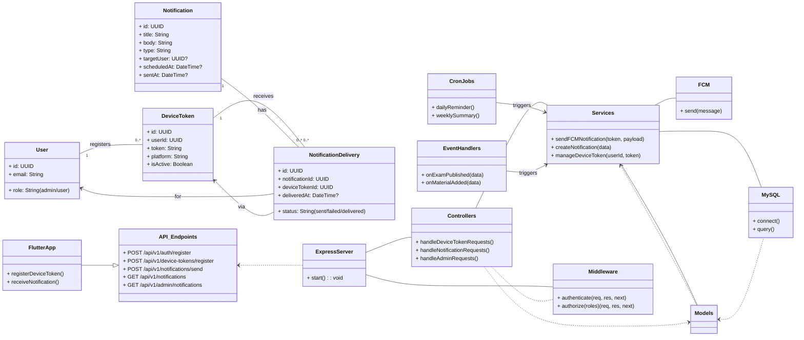

# Notification Service ✨


A comprehensive, full-stack notification service featuring an Express.js backend with MySQL, Sequelize, JWT authentication, role-based authorization, Firebase Cloud Messaging (FCM) integration, cron jobs, and an event system. It is complemented by a multi-platform Flutter client application for seamless reception of notifications across iOS, Android, and Web platforms.

## 🌟 Key Features

-   **Device Token Management**: Robust system to register, update, and manage unique device tokens for targeted push notifications across various platforms (iOS, Android, Web).
-   **Real-time Notification Delivery**: Leverages Firebase Cloud Messaging (FCM) to efficiently send push notifications, ensuring timely delivery to end-user devices.
-   **Robust Authentication & Authorization**: Secure API endpoints using JSON Web Tokens (JWT) for authentication and implements fine-grained, role-based access control (Admin/User) for system functionalities.
-   **Automated Scheduled Notifications**: Includes built-in cron jobs for sending recurring notifications such as daily reminders and weekly summaries, enhancing user engagement and information dissemination.
-   **Event-Driven Notification System**: Triggers notifications dynamically based on specific system events (e.g., `examPublished`, `materialAdded`), allowing for responsive and context-aware communication.
-   **Database Management**: Utilizes MySQL as the persistent storage layer, managed efficiently with the Sequelize ORM, storing users, device tokens, notifications, and delivery statuses.
-   **Comprehensive Logging**: Integrated Winston Logger provides detailed, color-coded application and request logging, crucial for debugging, monitoring, and auditing system operations.
-   **Admin Capabilities**: Dedicated controllers provide administrative functionalities for managing and broadcasting notifications effectively.
-   **Socket.IO Integration**: (Inferred from project structure) Potential for real-time bidirectional communication, enabling interactive notifications or immediate updates.

## 🛠️ Tech Stack

-   **Backend**: Node.js, Express.js
-   **Database**: MySQL, Sequelize ORM
-   **Messaging**: Firebase Cloud Messaging (FCM)
-   **Authentication**: JWT (JSON Web Tokens)
-   **Frontend (Test App)**: Flutter, Dart
-   **Mobile Platform Specifics**: Kotlin (Android), Swift (iOS)

## ⚙️ Architecture



## 🚀 Installation

Follow these steps to get the Notification Service up and running on your local machine.

### Prerequisites

Ensure you have the following installed:

-   [Node.js](https://nodejs.org/en/) (v18 or higher)
-   [npm](https://www.npmjs.com/) (comes with Node.js)
-   [MySQL Server](https://dev.mysql.com/downloads/mysql/) (v8.0 or higher)
-   A [Firebase Project](https://console.firebase.google.com/) with Cloud Messaging enabled.
-   [Flutter SDK](https://flutter.dev/docs/get-started/install) (for the test application)

### Backend Setup

1.  **Clone the repository:**
    ```bash
    git clone https://github.com/your-username/notification_service.git
    cd notification_service
    ```

2.  **Install dependencies:**
    ```bash
    npm install
    ```

3.  **Environment Configuration:**
    Create a `.env` file in the root directory by copying `.env.example` and fill in the necessary details:
    ```ini
    # Database Configuration
    DB_HOST=localhost
    DB_USER=root
    DB_PASSWORD=your_mysql_password
    DB_NAME=notification_service_db
    DB_DIALECT=mysql

    # JWT Configuration
    JWT_SECRET=your_jwt_secret_key
    JWT_EXPIRES_IN=1h

    # Firebase Configuration
    FCM_SERVICE_ACCOUNT_PATH=/path/to/your/firebase-service-account.json

    # Application Port
    PORT=3000
    ```
    *Make sure to replace placeholder values with your actual credentials.*

4.  **Firebase Service Account Key:**
    Download your Firebase service account key (JSON file) from your Firebase project settings (Project settings -> Service accounts) and place it at the path specified in `FCM_SERVICE_ACCOUNT_PATH` in your `.env` file, e.g., `config/firebase-admin-sdk.json`.

5.  **Database Migrations and Seeding:**
    Set up your database tables and optionally seed them with initial data:
    ```bash
    npx sequelize db:create    # Create the database if it doesn't exist
    npx sequelize db:migrate   # Run database migrations
    npx sequelize db:seed:all  # (Optional) Seed the database with demo data
    ```

### Flutter Test Application Setup (`flutter_test_app`)

1.  **Navigate to the Flutter app directory:**
    ```bash
    cd flutter_test_app
    ```

2.  **Get Flutter dependencies:**
    ```bash
    flutter pub get
    ```

3.  **Firebase Configuration for Flutter:**
    Follow the [official Firebase Flutter setup guide](https://firebase.google.com/docs/flutter/setup) to add your `google-services.json` (for Android) and `GoogleService-Info.plist` (for iOS) files to their respective platforms within `flutter_test_app`.

## ▶️ Usage

### Starting the Backend Server

From the `notification_service` root directory:

```bash
npm start
# Or, for development with nodemon (if installed globally)
# npm run dev
```

The server will start on `http://localhost:3000` (or your specified `PORT`).

### Running the Flutter Test Application

From the `flutter_test_app` directory:

```bash
flutter run
```

This will launch the Flutter application on your connected device or emulator, allowing you to register device tokens and receive test notifications.

## 📚 API Reference

All API endpoints are prefixed with `/api/v1`.

### Authentication

| Method | Endpoint               | Description              | Authentication |
| :----- | :--------------------- | :----------------------- | :------------- |
| `POST` | `/auth/register`       | Register a new user      | None           |
| `POST` | `/auth/login`          | Authenticate user & get JWT | None           |

### Device Token Management (Requires JWT Token in `Authorization` header)

| Method | Endpoint                       | Description                            | Authentication |
| :----- | :----------------------------- | :------------------------------------- | :------------- |
| `POST` | `/device-tokens/register`      | Register or update a user's device token | User / Admin   |

### Notifications (Requires JWT Token in `Authorization` header)

| Method | Endpoint                        | Description                                  | Authentication |
| :----- | :------------------------------ | :------------------------------------------- | :------------- |
| `POST` | `/notifications/send`           | Send a notification (requires `admin` role)  | Admin          |
| `GET`  | `/notifications`                | Get all notifications for the authenticated user | User / Admin   |
| `PUT`  | `/notifications/:id/read`       | Mark a specific notification as read         | User / Admin   |

### Admin Endpoints (Requires JWT Token and `admin` role)

| Method | Endpoint                          | Description                               | Authentication |
| :----- | :-------------------------------- | :---------------------------------------- | :------------- |
| `GET`  | `/admin/notifications`            | Get all notifications in the system       | Admin          |
| `DELETE`| `/admin/notifications/:id`       | Delete a specific notification            | Admin          |

## 👋 Contributing

We welcome contributions to the Notification Service! Please follow these steps:

1.  Fork the repository.
2.  Create a new branch (`git checkout -b feature/your-feature-name`).
3.  Make your changes and ensure tests pass.
4.  Commit your changes (`git commit -m 'feat: Add new feature'`).
5.  Push to the branch (`git push origin feature/your-feature-name`).
6.  Open a Pull Request.

## 📄 License

This project is licensed under the MIT License - see the [LICENSE](LICENSE) file for details.

---

*This `README.md` was generated based on the project structure and provided context.*
